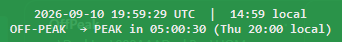

# OffPeakClock

A tiny always-on-top Windows widget that shows whether [DeepSeek API](https://api-docs.deepseek.com/quick_start/pricing) pricing is currently **PEAK** or **OFF-PEAK**, with a live countdown to the next switch.



## Schedule

DeepSeek off-peak rates are half of peak rates. Peak applies only in these windows, in Beijing time (UTC+8):

| Period   | Hours (Beijing)          | Hours (UTC)                 | Days                                          |
| -------- | ------------------------ | --------------------------- | --------------------------------------------- |
| Peak     | 09:00-12:00, 14:00-18:00 | 01:00-04:00, 06:00-10:00    | Monday-Friday, excluding Chinese public holidays |
| Off-peak | all other hours          | all other hours             | weekends in full, holidays in full            |

The 12:00-14:00 break, nights, weekends and holidays are all off-peak. Make-up workdays (调休) that fall on a Saturday or Sunday stay off-peak: DeepSeek bills by date type, not by whether a day is worked. Chinese public holidays are off-peak for the entire day.

### Holiday calendar

Holiday dates ship with the app: the official State Council rest periods from [国办发明电〔2025〕7号](https://www.gov.cn/zhengce/zhengceku/202511/content_7047091.htm) for 2026:

| Holiday            | 2026 dates   |
| ------------------ | ------------ |
| New Year           | Jan 1-3      |
| Spring Festival    | Feb 15-23    |
| Qingming           | Apr 4-6      |
| Labor Day          | May 1-5      |
| Dragon Boat        | Jun 19-21    |
| Mid-Autumn         | Sep 25-27    |
| National Day       | Oct 1-7      |

When the State Council publishes the next year's notice, add its rest dates to `offpeak_clock.json` next to the executable:

```json
{"holidays": ["2027-01-01", "2027-01-02", "2027-10-01"]}
```

Dates list as `YYYY-MM-DD`, are treated as holidays, and are cleaned (invalid entries dropped, duplicates removed) every time the app loads or saves. Make-up workdays never need listing, because weekends are off-peak in full. An updated release will embed the dates when the notice lands.

The clock shows current UTC and local time, and the countdown shows the next switch in your local time.

## Features

- Live PEAK / OFF-PEAK indicator (red / green), marked `(CN holiday)` on holiday dates
- Countdown to the next rate switch, in local time
- Chinese public holiday calendar built in, extendable via config
- Always-on-top; drag anywhere to reposition
- Right-click menu: Always on top, Start with Windows, Quit
- Single-instance guard - launching it again does nothing
- Remembers position and settings in `offpeak_clock.json` next to the executable

## Download

Grab `OffPeakClock.exe` from the [latest release](https://github.com/JerkyJesse/deepseek-offpeak-clock/releases/latest) and run it. Windows 10/11, no installer, no dependencies.

## Usage

- **Drag** the widget with the left mouse button to move it.
- **Right-click** for the menu (always on top, start with Windows, quit).
- **Esc** or **Alt+F4** quits when the widget has focus.

## Run from source

```
python offpeak_clock.py
```

Requires Python 3.8+ with tkinter (Windows).

## Tests

```
python -m unittest -v test_offpeak_clock
```

The suite covers the rate schedule boundaries, the embedded 2026 holiday calendar checked against an independently written copy of the notice dates, minute-by-minute brute-force checks of the next-switch calculation across the National Day and Spring Festival gaps, user-added holidays, formatting, window-position clamping, and config loading.

## Build

```
pip install pyinstaller
pyinstaller --noconfirm OffPeakClock.spec
```

Produces `dist/OffPeakClock.exe` (single file).

## License

Dual-licensed: [PolyForm Noncommercial 1.0.0](LICENSE) for noncommercial use, or a [commercial license](COMMERCIAL.md) for any commercial purpose. Contact: mechapip@mechapip.com
